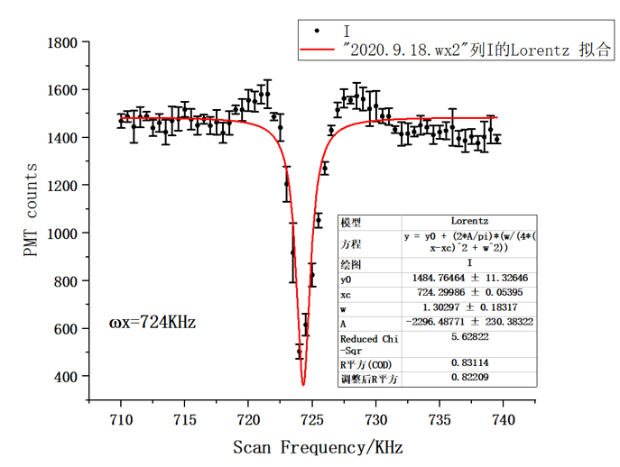
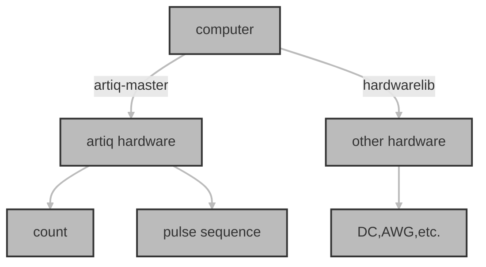
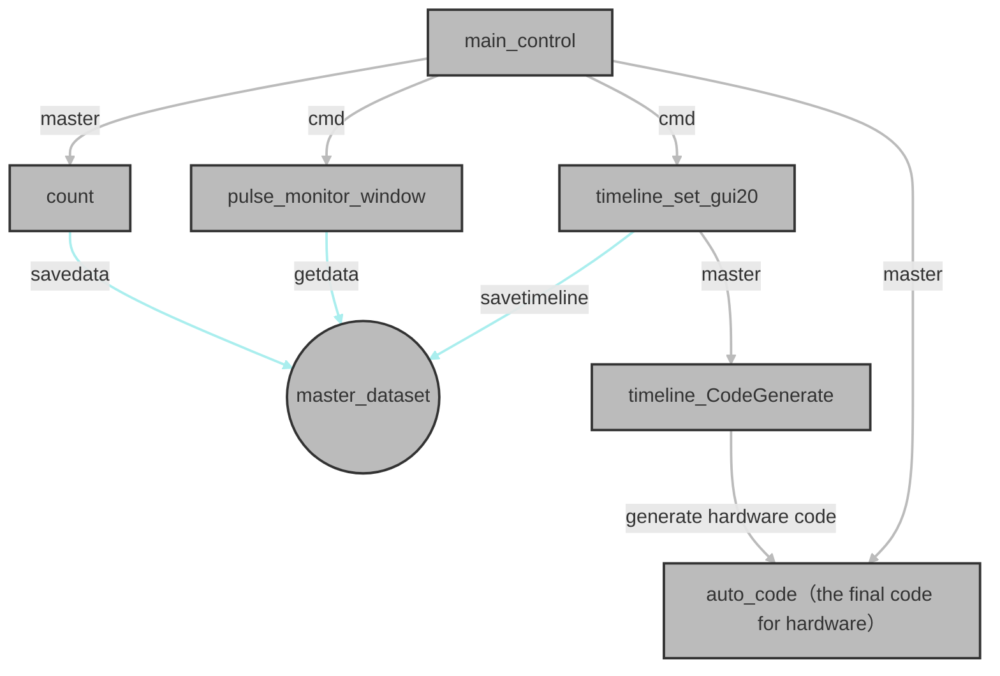

### This document is not complete and is still being updated

Update 2-27, 2023: I found this manual is far from complete. If one is really interested in it, please contact me. I will offer my bachelor's thesis part of which is the guide on how to use this system (Here only
part of its functions are introduced). Also directly
contact me if you want to discuss some technical details.
# preface

  This control system is designed for LabIon, Quantum Information-Measurement-Control Group, school of physics and astronomy, Sun Yat-Sun university. Our lab is under prof. Le Luo's lead. 

  This doc intends to offer an introduction and a technical specification to the control system. Although the target readers are basically members of our lab, I firmly believe that one can always find something interesting here.

  

  I started this project at the beginning of 2018, months after I entered SYSU as an undergraduate. Thanks to my experience with Pascal and Arduino in high school, I got the opportunity to work for the Trap Ion Lab in the school of physics and astronomy, assigned to write the control system. 

  At the very first I have little knowledge of python as well as other experiment equipment which were far more complicated than relays or a little infrared sensor. I still remember how panic I was when the seller of an FPGA extend model trying to explain the specification to me, and how many nights I spent in the laboratory. I have encountered countless trouble during the procedure, as well as learned a large amount of knowledge. It is this invaluable experience that helps me develop my programming skills and got a basic understanding of modern experimental physics.  
  
  I would like to express my gratitude to Dr.Zhao Wang, who selflessly offers any kind of guidance and support to me. I would also like to thank prof. Le Luo for providing that opportunity and enlightened me with the beauty of atomic physics.  I appreciate the help from Mr. Sébastien Bourdeauducq in M-Lab and the help from Dr. Cui Kaifeng in Chinese Academy of Sciences for their patient guidance.

# Introduction
  

  The main target of this system is to accomplish fully automatic control of the experiment equipment through several GUI pannels, without any need of programming. The centre of our equipment is a linear ion trap, which is used to conduct Precision atomic molecular photophysics experiments aiming to accomplish quantum simulation and quantum computation. Another essential part is an FPGA bought from M-Lab, used to control the timeline of the experiment. Others equipment includes RF signal sources, CCD, PMT, RWG, etc.

  The system is written in python. As I expressed in preference, this control system is also the procedure of my learning about python. You may even find the trace of my learning, from repeating a similar code several times to using extremely complicated multiple `getattr` and `setattr`. Although most of the "historical problems" will not influence the operation of the control system, there is still something I did not optimize out of caution, and one should pay attention to. 
   <div  align="center">    

  

  An example of using this system to test the trap frequency, experiment conducted by PhD student X.X.Rao and P.F.Lu.

  </div>
  
# Copyright and ownership issue
  Since this control system is my most important work at the first two years in university and I am going to mention this work when I apply a higher academic degree, I would like to clarify the copyright and ownership of this job.
  The timeline control part of this system is based on M-Lab's python gateware (imported as python modules), part of M-Lab's Artiq system, which makes the FPGA able to be controlled by python instead of VHDL. The gateware code as well as other parts of the Artiq system are not my work and are not included here but at M-Lab's GitHub page <https://github.com/m-labs/artiq>. The codes published here is an upgrade, specifical design for our Lab, with several GUI interfaces, easy-to-control timeline sequence, and integration with other hardware.
  And I would like to declare that all the codes published here are written by myself except the codes in `artiq-master/other_subgui`, where a portion of the contribution are made by other members of our Lab(specific recorded in the py file).
# Further development
This system is still being upgraded with the process of our experiment.

An important change(2020-10-10) is that I added a new function so that the timeline can also be planned through a txt file instead of using my timeline planning panel. Either method can be used by users based on their preference. 

The dictionary will be reorganized that useless test files or previous versions will be hidden and the name of the files will be renamed with clearer regularity.

However, since I am about to graduate, this system will be taken over by master or PhD students in our Lab. It is their choice to keep updating this system.

# Fast user guide
  This section intends to offer a basic instruction of the control system, requires zero knowledge of python. 
### before using the system
  Before using the system as well as modified it, one should bear in mind the difference of "low time resolution timeline" and "high time resolution timeline" when designing the experimental system. The word "timeline" here refers to a sequence of hardware output, and the low time resolution timeline always relays to the equipment which cannot reach a high time resolution(in this case, 10ns level). The typical representation is our DC source, RF source, etc., most of whom can only be controlled through GPIB, LAN, etc. This will lead to a low time resolution unless the hardware allows the computer to upload the entire timeline at one single communication. (Still, it will create some inconvenience when cooperating with other equipment.)

  The high time resolution timeline, on the other hand, can reach an extremely high time resolution. The only programmable hardware in our lab is the Artiq-kasli FPGA. By upgrading the entire timeline(written on python, describe the TTL output sequence regardless of the actual physical process its control), the FPGA can conduct the time sequence, **and the computer is not able to control the TTL sequence when the FPGA is outputing**(except the emergence stop)

  An example may help the reader to understand the difference. During an atomic experiment, laser sequences are used to accomplish the manipulation of the atom and its quantum states, Such as Doppler cooling, state flipping, and state detecting. 
  
  Now, if physically the duration between those steps can be a relatively long and inaccurate time, then the corresponding TTL sequence(control the laser sequence) should be written in different timeline file and called separately by the control system because writing them in the same file can reach nothing except giving more burden to the hardware. The other hardware, especially those with a low time resolution, can change their output during this break.

  If the TTL sequence(equal to high time resolution laser sequence in this case) needs to cooperate with other hardware, for example, an RF signal source, which should output a signal at an exact time during the TTL sequence. Under this circumstance, it is important to reiterate that this synchronous hardware cannot be controlled by the computer because now it is part of the high time resolution timeline. The only way to integrate it into the high time resolution timeline, is to use its trigger(if it has) and assign a TTL port from the FPGA to control it. The setting of the trigger and the parameters of the signal can be set by computer before the executing of the timeline, of course.
### start the control system 
  Click the `start.py` python file and the entire system will be lunched.

  In case of some unpredicable things happen, here I offer the specific method to start the system which is actually that py file do:
  - Open cmd, run `activate artiq-kasli`. You may need to use `cd` to change your path.
  - Run `artiq_master`. You need to set the path to where there is a folder named `repository`.
  - Open another cmd and run `activate artiq-kasli` and still you may need to use `cd` to change your path.
  - In the new cmd, run `artiq_dashboard` to open the gui provided py artiq. Although theoretically we don't need that gui, it is important when we want to test and monitor the operation of the system.
  - Open a now cmd for the third time and run `activate artiq-kasli` and still you may need to use `cd` to change your path.
  - In the third cmd, run `python main_control_gui20.py` to lunch the main control pannel.
### The main control pnnnel
  <!--  -->
  <div  align="center">    
  

  main control panel
  </div>

  <!-- <div  align="center">    
  
  </div>
   -->

  ##### basic propertise
  
  This interface is the main pannel of our control system. The most important function of this panel is to plan the low-time-resolution hardware' timeline. One can specify any output value of any equipment with a parameter scan mode(linear, random, etc.). Different equipment can scan the output value simultaneously. This function is designed to change the hardware' output before a corresponding laser sequence.  After every move of the hardware scan, the laser sequence will execute for given loop times (1 for now), after which the hardware scan will move to the following values. The laser sequence will not change, for now.

  Besides, some important hardware' control panel can be activated through it, for example, the DC source and the PMT. Those sub-pannel are synchronous to the hardware timeline. For example, one can disable a DC channel from the sub-pannel even if the hardware time is calling it.
    
  ##### specific function of each elements
  We are going to introduce each element from top to button.

  - `activate timeline set`:lunch a sub-interface which is used to set the timeline.  
  - `activate pulse monitor`:Lunch the watch window for a PMT. 
  - `start count`:Start to rcord the data from the PMT for a given time length. The new data will follow old data. See (not yet complete) for detial. 
<!-- - !!!!!!!!!!!!!!!!!!! -->
  - `clear data`:delete all the data record by PMT.
  - `save`:Save the PMT data in the form of txt.
  - `activate DC set`:Lunch the sub-interface for the 16channel DC source. 
  - `run timeline`:Run the time line for a certain number of times with a hareware scan plan. The number of times are set by `round time` and the hareware scan plan is dertermined by several elements in main control pannel. 
  - `round time`  
  - `add`
  - `clean hardware set`
  - `update_manually`
  - list:scan mode
  - `hareware name`
  - `parameter`
  - `start value`
  - `Len`
  - `scan mode`
  - `scan time length`

### The timeline plan panel
   <div  align="center">    
  

  the timeline control panel
  </div>


### The 16 channel DC control pannel
<div  align="center">    
  

  the DC control panel
  </div>

### other panel

# Structure of the system
## Main hardware
- **schematic explaination for the hardware control sequence **

  - **FPGA**
  Our experiment system is revolved around an FPGA with high time resolution, which is used to control laser on and off. This FPGA is developed by M-Lab who offers a basic python getware. Specifically, we use this FPGA to generate a square wave pulse with nanosecond-level time resolution, as the control signal to an Isolation switch. This switch allows and blocks an RF signal to an AOM and finally generate a laser pulse.
  - **DC Source**
  A 16-channel DC source is used to control 10 of 12 blades of the ion traps to alter the shape of the potential well and compensate the micromotion. This DC source's resolution is less than 30uV and each channel can be controled seperately.
  - **Microwave generator**
  - **AWG**
    This AWG allows user to program its output ahead of schedule and use pulse to trigger it.
  - **PMT**
    A photon counter is used in our system. An SMA connector directly connect its output to Artiq box's input channel and each pulse represent a photon count. See PMT's manual for the detail of efficiency.
  - **CCD**
    This CCD also has trigger mode where each input pulse can trigger it to take a photo.  


## software structure


  
  
  ##### high accuracy timeline control sysyem
  Laser sequence is the centre of our experiment, and the timeline control system is of vital importance. M-Lab offers a gateware, the artiq system, that allows us to use python code to control the FPGA. However, the original gatware requires users to write the timeline in python code, which is less convenient and hard to cooperate with other equipment. Based on the Artiq system, we develop it to our timeline control system, with a full-featured(within our experiment) GUI panel and no longer need to write any python code. 
  - **brief introduction to artiq python getware**
    This part intend to offer a fast introduction of the artiq system to interest readers, especially members of our Lab. The offical guidance can be view in [website]<http://m-labs.hk/experiment-control/resources/> and [manual]<https://m-labs.hk/artiq/manual/>. Here we mainly introduce the part we developed in our control system. 
  - **structure of the timeline control system**

- **schematic explaination for the timeline code process sequence with Artiq package**

  
  ##### general hardware control system
  - **schematic explaination for the hardware control sequence**
  ```mermaid
  graph TD
  classDef className fill:#bbb,stroke:#333,stroke-width:2px;
  A[main_control]
  B[hardwarelib]
  C[DC_set_subwindow]
  D((16chanDC))
  E((SG382))
  
  A--import and call-->B
  A--"open"-->C
  C--serial-->D
  B--serial-->D
  B--"independent"---C
  B--net-->E

  class A,B,C,D,E className;
  linkStyle 0,1,2,3,4,5 stroke:#bbb,stroke-width:2px;
  ```
# technical specification 
