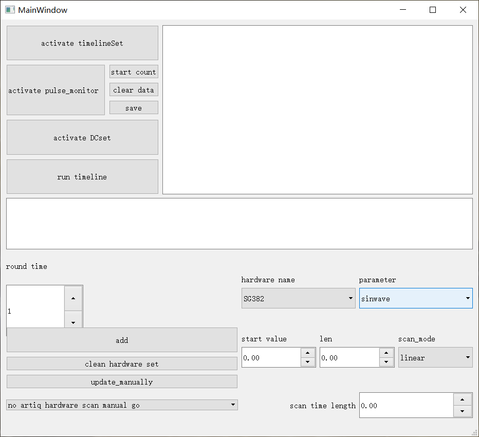

# preface
  This doc intends to offer an introduction and technical specifiction to the control system. Although the target readers are basiclly members of our lab, I firmly brlieve that one can always find something interesting here.
  I start this project at the end of 2017, months after I enter SYSU as an undergraduate. Thanks to my experience with pascal and arduino in high school, I got the opportunity to work for the Trap Ion Lab in school of physics and astronmy, assigned to write the control system. 
  At the very first I have little knowledge on python as well as other physics euipments which are far more conplicate than relays or a little infrared sensor. I still remember how panic I am when the seller of an FPGA extend model trying to explain the specification to me, and how many nights I spent in the labotary. I have encountered countless troble during the procedure, as well as learned large amount of knowledge. It is this invaluable experience that helps me develope my progromming skills and have a bisic understanding of morden experimental physics. I would like to express my gratitude to Dr. Wang Zhao, who selflessly offers any kind of guidance and spport to me. I would also like to thank prof. Le Luo for offering that opportunity and enlightened me with the beauty of atomic physics.    

# Introduction
  This control system is designed for LabIon of school of physics and astronomy, Sun Yat-Sun university. Our lab is under prof. Le Luo's lead. 

  The main target of this system is to achieve fully automatic control of our equipments including a linear ion trap, which are used to conduct Precision atomic molecular photophysics experiments aiming to accomplish quantum simulation and quantum computation.

  The system is written in python. As I expressed in preference, this control system is also the procedure of my learning about python. You may even find the trace of my learning, from repeating a similar code several times to using extremly conplicate multiple `getattr`and `setattr`. Although most of the "historic problems" will not influence the operation of the control system, there are still something I did not optimize out of caution and one should pay attention to. 

# Fast user guide
  This section intends to offer a basic instruction of the control system, requires zero knowledge of python. 
## start the control system 
  Click the `start.py` python file and the entire system will be lunched.
  In case of some unpredicable things happen, here we offer the specific method to start the system which is actually that py file do:
  - Open cmd, run`activate artiq-kasli`. You may need to use `cd` to change your path.
  - Run `artiq_master`. You need to set the path to where there is a folder named `repository`.
  - Open another cmd and run `activate artiq-kasli` and still you may need to use `cd` to change your path.
  - In the new cmd, run `artiq_dashboard` to open the gui provided py artiq. Although theoretically we don't need that gui, it is important when we want to test and monitor the operation of the system.
  - Open a now cmd for the third time and run `activate artiq-kasli` and still you may need to use `cd` to change your path.
  - In the third cmd, run `python main_control_gui20.py` to lunch the main control pannel.
## The main control pnnnel
  <!--  -->
  
    
  
  

  ### basic propertise
  
  This interface is the main pannel of our control system. Besides activating several sub-interface, the most important function of this pannel is to plan the entire hardware experiment schedule. One can specify any output value of any equipment with a parameter scan mode(linear, random etc.). Different equipments can scan the output value simultaneously. This function is designed to change the harewares' output before the laser sequence.  **After every move of the hareware scan the laser sequency will execute for a given loop times(1 for now), after which the hardware scan will move to next values.语言不好**
    
  ### specific function of each elements
  We are going to introduce each element from top to button.

  - `activate timeline set`:lunch a sub-interface which is used to set the timeline.  
  - `activate pulse monitor`:Lunch the watch window for a PMT. 
  - `start count`:Start to rcord the data from the PMT for a given time length. The now data will follow old data. See **还没补上** for detial. 
  - `clear data`:delete all the data record by PMT.
  - `save`:Save the PMT data in the form of txt.
  - `activate DC set`:Lunch the sub-interface for the 16channel DC source. 
  - `run timeline`:Run the time line for a certain number of times with a hareware scan plan. The number of times are set by `round time` and the hareware scan plan is dertermined by several elements in main control pannel. 
  - `round time`  
  - `add`
  - `clean hardware set`
  - `update_manually`
  - list:scan mode
  - `hareware name`
  - `parameter`
  - `start value`
  - `Len`
  - `scan mode`
  - `scan time length`
# Structure of the system
## Main hardware 
  - FPGA
  Our experiment system is revolved around an FPGA with high time resolution, which are used to control laser on and off. This FPGA is developed by M-Lab who offers a basic python getware. Specificlly, we use this FPGA to generate a square wave pulse with nanosecond-level time resolution, as the control signal to an Isolation switch. This switch allows and blocks an RF signal to an AOM and finally generate a laser pulse.
  - DC Source
  A 16-channel DC source is used to control 10 of 12 blades of the ion traps to alter the shape of the potential well and **compensate the micromotion?**. This DC source's resolution is less than 30uV and each channel can be controled seperately.
  - Microwave generator

## software
  The control system accomplish fully automatic control of the experiment equipments through several gui pannels, without any needed of programing.
  ### high accuracy timeline control sysyem
  laser sequency is the center of our experiment, and the timeline control system is of vital importance. M-Lab offers a geteare, the artiq system, that allows us to use python code to control the FPGA. However, the original getware requires users to write the timeline in python code, which is less convinience and hard to coorperate with other equipment. based on the artiq system, we develope it to our timeline control system, with a full-featured(within our experiment) gui pannel and no longer need to write any python code. 
  - brief introduction to artiq python getware
    This part intend to offer a fast introduction of the artiq system to interest readers, especially members of our Lab. The offical guidance can be view in [website]<http://m-labs.hk/experiment-control/resources/> and [manual]<https://m-labs.hk/artiq/manual/>. Here we mainly introduce the part we developed in our control system. 
  - structure of the timeline control system
  
  ### general hardware control system
# technical specification 
