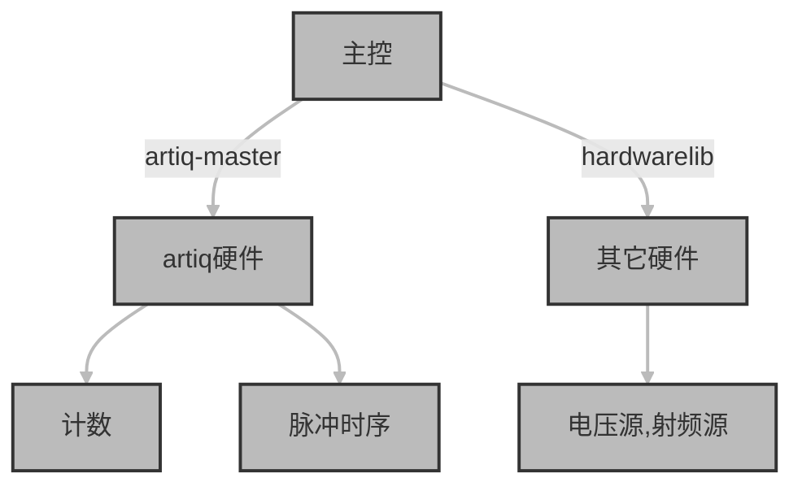
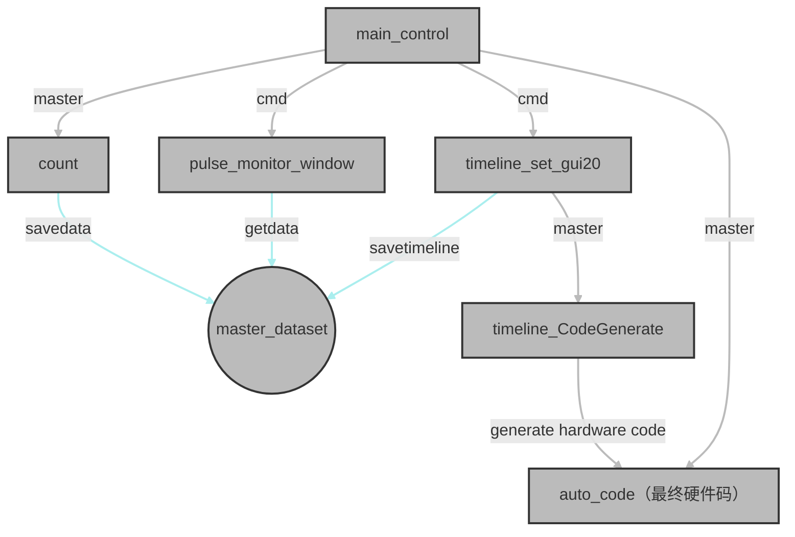

# 前言
本文主要讲述操作、修改本控制系统所需要的必要知识，全面了解artiq系统的知识参见官网说明书。同样本文对于python和pyqt的讲解仅限于控制系统使用到和涉及到的，以后有可能会撰写python和pyqt学习笔记，但还是建议对其进行系统性地学习。
### 需要掌握的知识
##### 基本python知识
随便找本书吧……
以下知识是重点要用的
[类的用法]<https://blog.csdn.net/swinfans/article/details/89393853>
[类的用法]<https://www.jianshu.com/p/d34a3e435477>
[list操作]<https://www.cnblogs.com/Yanjy-OnlyOne/p/9808130.html>
getattr后面会讲
##### PyQt5图形界面编写
##### artiq系统
[官网]<http://m-labs.hk/experiment-control/resources/>
[官方说明书]<https://m-labs.hk/artiq/manual/>

# artiq初步
### 硬件构成
我们采用的artiq-kasli模块主要使用的是40路ttl输入/输出端口，其在artiq-python接口中的编号为ttl0-39,其中ttl0-15仅用于输入。而ttl16-39仅用于输出。
### 控制逻辑
artiq硬件为FPGA可编程门阵列，其厂家提供了一套python-硬件接口，其本质上可以理解为一个python代码编译器，对于普通的python代码采用一般的python编译器进行处理，而对于经过特殊标记（详见下文）的硬件执行代码采用其厂家独有的编译过程将python风格的代码转换成硬件能够理解的任务并执行任务。这使得我们不必采用复杂而扩展困难的FPGA专用的编程语言，而可以直接使用python编程语言对代码进行控制。
### 基础代码
以下将通过一个最简单的artiq代码来展示其工作过程和工作原理，代码功能是使得一个ttl端口输出脉冲
```
from artiq.experiment import *  #导入相关包
 class LED(EnvExperiment):  #类名，当提交给master时需要标明
    '''led02'''
    def build(self):      #初始化，必须以build为函数名
        self.setattr_device("core")
        self.setattr_device("ttl16")
                          #通过setattr_device设置硬件名称，名称必须存在  
    @kernel               #用于硬件执行的标识符，否则为纯python代码在电脑执行
    def run(self):        #在硬件上执行的部分，必须以run命名
        def a(self):      #可以在此def下设置二级def
             self.ttl16.on()    #ttl16端口高电平
             delay(3000000*us)  #等待
        def b(self):
             self.ttl16.off()   #ttl16端口低电平
             delay(3000000*us)  #等待
        self.core.reset()       #必须先reset来重置时间轴
        a(self)
        b(self)
        a(self)
        b(self)
```
**需要注意的是直接执行的代码同级目录、artiq_master同级目录等地方（最好是所有涉及的目录），都需要一个名为`device_db.py`的文件来说明硬件构成和硬件名称，一般而言其都是相同的不需要修改。**
更多进阶和高级用法将在以下讲述artiq系统架构时提及。
# 系统架构
### artiq系统架构
- 系统环境
  artiq系统采用python环境，每次运行调用artiq包的代码时必须启动artiq环境，而一般不能在编译器中直接运行。方法为在cmd中输入`activate artiq-kasli`,（或是activate安装artiq环境时的命名）.
- 执行单个任务文件
  执行artiq代码有两种方式：
  - `artiq_run`
    打开cmd，启动artiq环境，调整路径至某文件夹，然后在同一个cmd中输入`artiq_run ***.py`,执行特定文件。
    主要用于执行需要在硬件上实施的代码。
  - `python`
    在cmd中输入`python  ×××。py`执行特定python文件。
    主要用于不需要在硬件上实施的代码。注意此时大部分时候仍然需要启动artiq环境。
    **注意artiq需要在硬件上实施的代码具有极大的限制，许多python的功能和图形界面的功能都无法使用。**
- artiq_master
  master是实际使用时常用的。其使用方法为：
  启动artiq环境；调整路径到`.../master`,且目录下有一名为repository的文件夹。
  master具有广泛的能力，可以将其视为一个任务管理后台，其主要功能包括：通过schedule（向其）提交任务并执行和通过datasets管理参数。
  一般的控制界面不宜涉及过多的artiq环境，同时也不要在硬件代码中添加复杂的控制逻辑，即导入并继承artiq实验环境包（`from artiq.experiment import *`）并调用其中在硬件上执行的函数（比如ttl），这将导致timeflow的问题。**一个合适的解决方法是讲复杂控制交由电脑上的python完成，通过artiq引入的client包搭建Client来控制master。**
  这也是时序编写的指导思想，即硬件执行代码在控制逻辑上要尽可能简单（但不一定短，事实上为了减少复杂逻辑，比如if、while的使用，最终执行的硬件代码就是一条时间轴一个一个往下添加硬件操作，但这是通过图形界面自动操作的，完全不用人工干预）
  具体的client、master的时序控制逻辑和代码见下文，我们首先先熟悉以下Client向master提交任务和储存、获取信息的基本使用方法。
  *Client的本质，如果打开其源代码进行检查，实际上是一个基于socket的网络端口*
  - 一个典型的，通过搭建Client，向master提交任务的代码为：
    ```
    import logging
    from artiq.protocols.pc_rpc import (Client)
    导入相关包
    /////////////////////////////////////////////////
    schedule, exps, datasets = [
    Client('::1', 3251, 'master_' + i) for i in 'schedule experiment_db dataset_db'.split()
    ]
    设置Client
    /////////////////////////////////////////////////
    expid = dict(
    file = 'repository/hello.py',
    class_name = 'hello',
    log_level=logging.DEBUG,
     arguments = dict(state = True,count =  5 )
    )
    设置提交任务的信息。包括指定其路径（必须在repository下），
    类名（hello），参数（state，count）。参数可以为空。
    /////////////////////////////////////////////////
    rid = schedule.submit(
    pipeline_name='main', expid=expid, priority=0, due_date=None, flush=False)
    submit提交任务，rid为返回值，可以不用管。
    ```  
    ---------------------------------------------------------
    注意被提交的代码实际上和artiq_run直接执行的代码是一样的，可以理解为使得master对某一文件使用artiq_run，因此在调试代码时可以使用artiq_run,但要注意此时仍然可能需要启动master。
  - 存储和获取参数的常用方法为
  `datasets.get("count_y")`获得名为"count_y"参数，其必须存在，可能不存在建议使用try-except语法。
  `datasets.set("count_y"，y)`存储名为"count_y"的参数，其来源为`y`。
  **注意上两种方法用于一般python代码，通过Client向master提交参数，而下面一种方法是用于硬件执行代码（如count）中的。**
  `self.set_dataset("count_y",self.countt,broadcast=True, save=False)`在硬件执行部分设置名为"count_y"的参数，其来源是`self.countt`。
  
    
  
    
### 控制系统架构
artiq系统实际上只是整个系统中时序控制部分所用的，与其说是使用了artiq系统，从python的角度来讲，更合适的表述是调用了一系列artiq环境提供的python包来实现硬件控制。
整个控制系统的架构可以表述为：
- 硬件架构

- 代码架构：artiq部分

- 代码架构：其它硬件部分
  ```mermaid
  graph TD
  classDef className fill:#bbb,stroke:#333,stroke-width:2px;
  A[main_control]
  B[hardwarelib]
  C[DC_set_subwindow]
  D((16chanDC))
  E((SG382))
  
  A--import and call-->B
  A--"open"-->C
  C--serial-->D
  B--serial-->D
  B--"independent"---C
  B--net-->E

  class A,B,C,D,E className;
  linkStyle 0,1,2,3,4,5 stroke:#bbb,stroke-width:2px;
  ```
#控制系统代码详解
**建议打开源文件配合注释观看。**
**切勿随意改动源文件！！手误了就control+Z按到头，最好有一个backup**
###专题：时序的格式
这一部分将介绍硬件扫描时序和artiq脉冲时序的创建、性质以及调用，以后介绍代码时不再重复。
- 硬件扫描时序
  - 性质
    硬件扫描时序本质上是一个list（python的一种基本数据格式，可以将其理解为一个元素类型任意的数组），其中每一位又是一个list类型，为方便行文可称其为sublist。其中包含四个元素：硬件名称（str），可变参数（str），起始值（float），扫描步长（float）。每一个sublist都代表了一个硬件的某一个可变参数，并且包含其扫描除了扫描次数之外其它所有需要的信息。list中包含了所有需要扫描的可变参数，无疑各个参数不应该重复。执行时，所有可变参数具有相同的扫描次数。
  - 创建
    硬件扫描时序由主控界面程序`main_control.py`中创建，其参数设置由主界面中的`hardware_name`,`parameter`,`start_value`,`len`设置并由`add`控件添加到硬件扫描时序中。
  - 执行
    每当需要执行时，相关的执行代码将读取硬件扫描时序并用多重for循环逐级逐个读取时序相关信息然后调用`hardwarelib`中的执行代码控制硬件。这一过程中使用了较为复杂的python中的`getattr`方法。
  - 显示与改动
    一个textedit控件将用于显示硬件时序，此控件允许手动修改，但是修改后回传的是str格式而非list格式，因此专门写了一个`str_to_list`函数用于转换。注意这个函数功能并不强，手动修改时一定要保持list的格式。
###主控
主控界面文件名称`main_control.py`。  
- class mainprogram:
  - def init(self):
    初始化参数.
    将class中继承的`Main_control_window`类中的各图形元件进行连接。
    注意：
    - `self.scan=Scan()`实例化硬件扫描列表；
    - `self.initsubwindow()`调用实例化子窗口的函数；
    - `self.initHardware()`调用初始化硬件的函数；
    - `self.timeer=QTimer()`实例化Timer；
    - `self.timeer.timeout.connect(self.timerun)`设置Timer对应的函数，将在后面`def run_without_artiq_settime`中详细说明。
  - def initsubwindow(self):
    此处实例化子窗口.
    只有有自己专用窗口的硬件才用在此处实例化，需要导入相应的模块。（比如：`from DC_set_subwindow import dc_16chan_mainwindow`）;与`hardwarelib.py`中的硬件列表独立（其实例化在`class scan`里面）

  - def initHardware(self):
    `_translate = QtCore.QCoreApplication.translate`用来更新主界面硬件下拉列表；  

  - def get_parameter(self):
    更新指定硬件具有的可变参数
    注意`def initHardware(self):`只在初始化中调用一次设定硬件列表，而每一次列表更新都会重新调用一次`def get_parmeter`（`def init`中`self.hardware_name.currentTextChanged.connect(self.get_parameter)`）来获得当前列表具有的可变参数。

  - def add_hardware_scan(self):
     提交当前扫描设置到硬件扫描时序。
     具有四个参数：
      - `hardware` 硬件名称，来自`self.hardware_name`控件；
      - `parameter` 可变参数名称，来自`self.parameter`控件；
      - `startvalue`扫描起始值，保留到点后6位精度，来自`self.start_value`控件；
      - `length`扫描步长，保留到点后6位精度,来自`self.len`控件；
     _注意此处没有设置扫描点数。_
     **注意代码中各个不同的控件获取参数值的不同方法。**

  - def show log(self):
    更新当前硬件扫描时序。
    注意先clear清空之前的。    显示控件为`self.textEdit`.

  - def update_manualy(self):
    手动更新硬件时序。
    注意其中调用`str_to_list`函数将str转换成list，用于手动修改列表后。修改时一定要保持list格式，特别注意当删除整行时换行符一定要删除干净。

  - def activate TLset(self):
    打开时序设置界面。
    采用的是调用命令行的方法，新界面与本界面完全独立，采用artiq_master进行数据交流，详见相关文档。
  - def activate_DCset(self):
    打开16路电压源的独立控制界面。

  - def data_from_DC(self):
  
  - def activate_pulse_monitor(self):
    启动PMT计数器界面。
    实际上打开的只是一个画图界面`pulse_monitor_window.py`，从master中获取数据。
  - def startcount(self):
    启动上载到artiq硬件的count代码`count/input_count_2.1.py`，详见相关代码说明。

  - def clear(self):
    清除画图界面。
    其原理是清除master中的数据。
  - def run_timeline(self):
    执行时序，其中`mode`为通过运行模式控件`self.run_mode`获得的模式，其具有三种模式：
    - no artiq hardware scan manual go
      手动步进扫描硬件参数，不启用artiq
    - no artiq hardware scan set time go  
      自动前进，时间可设置
    - artiq with hardware set
      自动前进并运行artiq时序
    以上每一种模式都会调用相关函数具体执行
  - def run_without_artiq_manual(self):
  - def run_without_artiq_settime(self):
  - def time_control(self):
  - def timerun(self):
  - def run_with_artiq(self):
  - def str_to_list(self):
  - def saveoutput:
    存储count的数据。
    
  
###其它硬件控制代码
- hardwarelib
- 硬件专属界面
  - 电压源
  - PMT计数
###artiq硬件控制代码
- 时序
- 计数
  - 图形界面
    计数的图形窗口名为`pulse_monitor_window.py`.
    其执行方式为调用cmd执行，为纯python代码，其作用是实时监控master的dataset中指定参数的变化。界面已经打开就会连续执行，所有对数据的添加、修改、删除都不会通过这一个界面（py文件）执行，而是通过直接改动dataset中的参数来实现。
    这一个文件本质上就是一个画图的功能，其基本实现方法为调用pyqtgraph包。使用方法很简单，直接看代码中的注释即可。
  - 硬件实现代码


